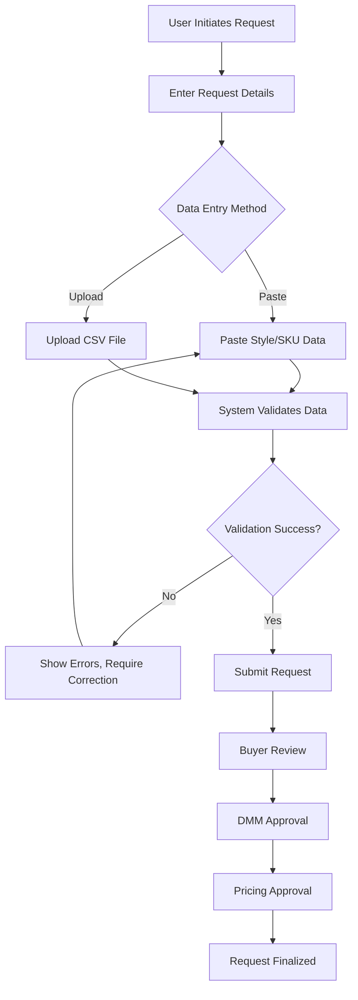
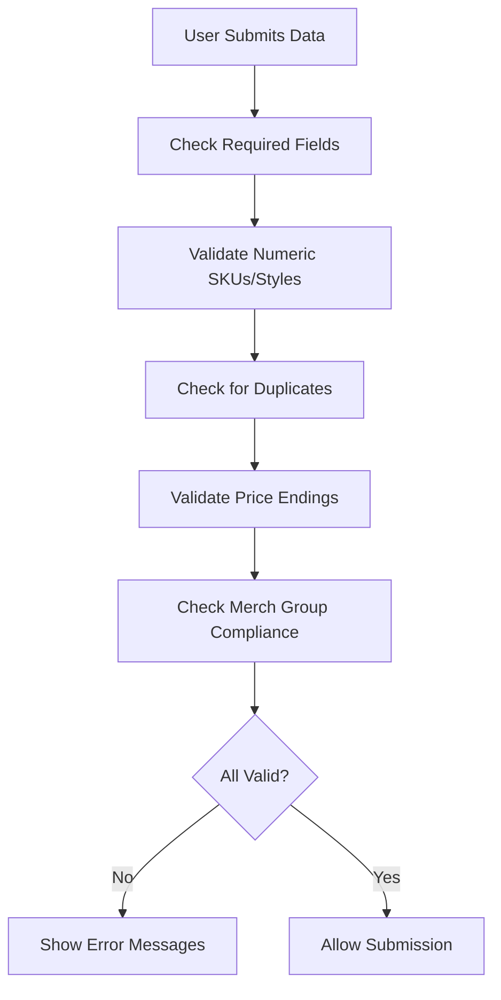
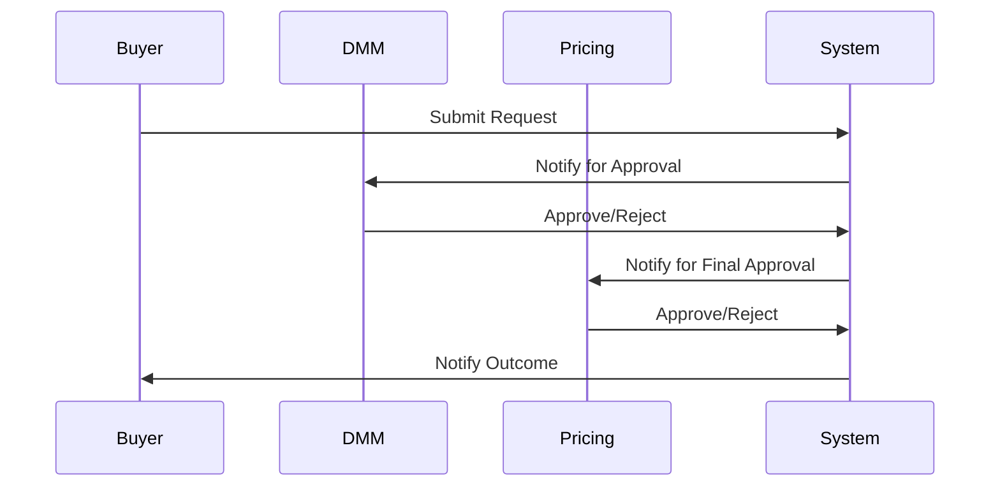
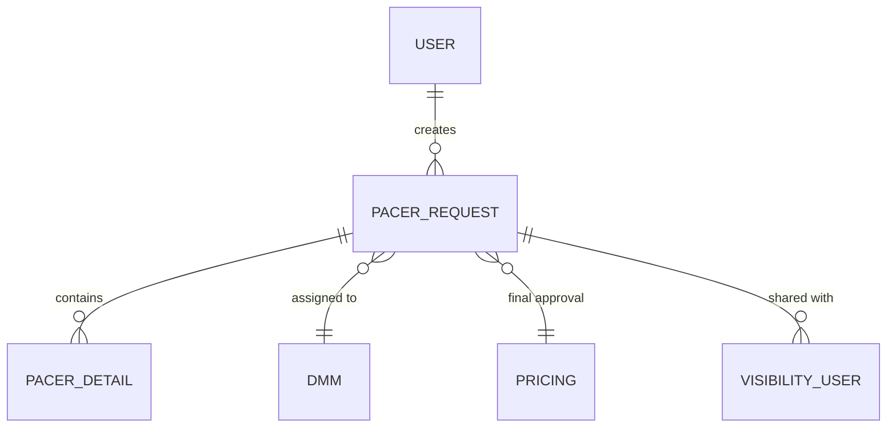

```markdown
# Business Requirement Document (BRD) for PACER Page Request System

---

## Introduction

This Business Requirement Document (BRD) outlines the requirements, objectives, and workflows for the PACER Page Request System, as derived from the provided .NET codebase. The document is intended to bridge the gap between technical implementation and business understanding, ensuring all stakeholders are aligned on system functionality, architecture, and expected outcomes.

---

## Business Objectives

- **Streamline Price Change Requests:** Automate and manage the process of submitting, validating, and approving price change requests for styles, SKUs, and color codes.
- **Enhance Data Accuracy:** Ensure all price change requests are validated for correctness, completeness, and compliance with business rules before approval.
- **Support Multi-Level Approval:** Facilitate a structured approval workflow involving Buyers, DMMs (Divisional Merchandise Managers), and Pricing teams.
- **Enable Bulk Operations:** Allow users to upload bulk requests via CSV files, supporting efficient handling of large data sets.
- **Audit and Visibility:** Provide logging, error tracking, and visibility controls for compliance and transparency.

---

## Functional Requirements

### 1. User Roles & Access
- **Buyer:** Can create, edit, and submit price change requests.
- **DMM (Approver):** Reviews and approves/rejects requests.
- **Pricing:** Final approval and event creation.
- **Super User:** Elevated permissions for testing and support.
- **Visibility Users:** Additional users can be granted view access to specific requests.

### 2. Request Creation & Editing
- Users can create new PACER requests or edit existing ones.
- Requests can be for styles, SKUs, or color codes.
- Users must provide required information: request name, merch group, notes, reason, effective date, approver, and organizational level (chain/store).
- The system validates required fields before allowing submission.

### 3. Data Entry & Validation
- Users can enter style/SKU/color data by pasting into a textbox or uploading a CSV file.
- The system validates entries for:
  - Format (numeric SKUs, valid price endings, non-zero prices)
  - Duplicates
  - Compliance with merch group and organizational rules
  - Maximum entry limits (e.g., 500 items per request)
- Invalid entries are highlighted and reported to the user.

### 4. File Uploads
- Users can upload CSV files for bulk style/SKU/color price changes.
- The system parses, validates, and processes the uploaded data, providing feedback on errors or duplicates.

### 5. Approval Workflow
- Requests follow a multi-stage approval process:
  - Buyer submits request.
  - DMM reviews and approves/rejects.
  - Pricing reviews and finalizes.
- Status updates and error messages are communicated to users at each stage.

### 6. Error Handling & Feedback
- The system provides real-time feedback on validation errors, missing data, and business rule violations.
- Errors are displayed in user-friendly popups and error charts.

### 7. Visibility & Audit
- All actions are logged for audit purposes.
- Users can add or remove visibility users for each request.
- The system tracks and logs user interactions and changes.

---

## Non-Functional Requirements

- **Performance:** The system must process uploads of up to 50,000 rows efficiently.
- **Security:** Only authorized users can create, edit, or approve requests. Sensitive data is protected.
- **Scalability:** The system must handle increasing numbers of requests and users without degradation.
- **Reliability:** All actions (uploads, approvals, edits) must be logged and recoverable in case of failure.
- **Usability:** The interface must provide clear feedback, error messages, and guidance for users.

---

## System Architecture

The PACER Page Request System is a web-based application built on ASP.NET Web Forms, utilizing a layered architecture:

- **Presentation Layer:** ASPX pages and code-behind files handle user interactions, form submissions, and UI logic.
- **Business Logic Layer:** Classes in `App_Code` (e.g., `ProcBuilder`, `Pacer`, `AddPacer`) encapsulate business rules, validation, and workflow logic.
- **Data Access Layer:** Data is accessed via stored procedures in an Oracle database, abstracted by classes like `PCRDAL` and invoked by business logic.
- **Integration:** File parsing (CSV), bulk data operations, and email notifications are integrated into the workflow.

---

## Workflows and Diagrams

### 1. Price Change Request Workflow



### 2. Data Validation Process



### 3. Approval Workflow



### 4. Entity Relationship Overview



---

## Assumptions and Constraints

- Users must have valid credentials and appropriate roles to access system features.
- All uploaded files must be in CSV format.
- Maximum of 500 styles/SKUs per request via paste; up to 50,000 via upload.
- Only numeric SKUs/styles are accepted.
- Price endings must conform to allowed values (e.g., .09, .19, .99, etc.).
- Intraweek events are not allowed at the store level.
- The system is integrated with an Oracle database; all data operations use stored procedures.
- The system must comply with corporate security and audit policies.

---

## Glossary

- **PACER:** Price Adjustment and Change Event Request.
- **DMM:** Divisional Merchandise Manager, an approver in the workflow.
- **SKU:** Stock Keeping Unit, a unique identifier for each product.
- **Style:** A product style, may encompass multiple SKUs.
- **Color Code:** Specific color variant of a style.
- **Effective Date:** The date when the price change becomes active.
- **Chain/Store:** Organizational levels for applying price changes.
- **Original/Exception:** Types of price change requests (original markdown or exception).
- **Bulk Upload:** Uploading large datasets via CSV files.
- **Visibility User:** Additional user granted access to view a specific request.
- **Validation:** System checks to ensure data correctness and compliance.
- **Approval Workflow:** The process of reviewing and approving requests by different roles.

---

# End of Document
```