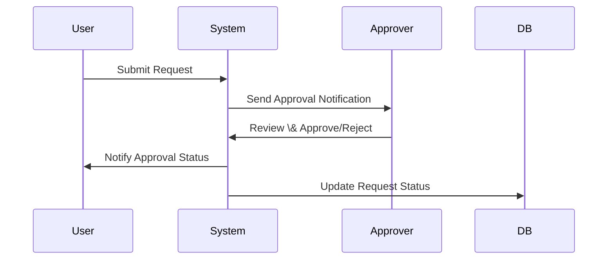

\# Business Requirement Document (BRD)


\## Introduction


This document outlines the business requirements for the PACER Release Request Application, a .NET web application designed to manage, process, and track PACER (Public Access to Court Electronic Records) release requests. The purpose of this document is to provide a comprehensive overview of the system’s objectives, functionality, architecture, and workflows, ensuring alignment between business stakeholders and technical teams. The scope includes all major modules, business logic, data flows, and system dependencies as derived from the provided .NET codebase.


---


\## Business Objectives


\- Streamline the submission, review, and approval process for PACER release requests.

\- Enable efficient management of product and SKU data associated with requests.

\- Facilitate secure and auditable user interactions, including file uploads and data exports.

\- Provide robust validation, error handling, and notification mechanisms to ensure data integrity and user guidance.

\- Support reporting and data export for business analysis and compliance.

\- Ensure scalability, security, and maintainability of the application.


---


\## Functional Requirements


\### 1. Request Management

\- Users can create, edit, and track PACER release requests.

\- Requests must include required fields: request name, merch group, notes, change reason, effective date, approver, and organization selection.

\- Users can enter styles/SKUs and prices via paste or CSV upload, with a limit of 500 entries per request.

\- The system validates all inputs, including price formats, duplicate entries, and organization selections.

\- Users can review and select items in a working list before submission.

\- Requests are saved to the database with all associated details.


\### 2. User Session Management

\- User authentication and session state are maintained throughout the application.

\- Session variables track user roles, permissions, and current request context.


\### 3. Data Export

\- Users can export request data and reports to Excel or CSV formats.

\- Exported data reflects the latest validated and approved information.


\### 4. Email Notification

\- Automated email notifications are sent for request submission, approval, and status changes.

\- Email templates are used for consistent communication.


\### 5. Product \& SKU Management

\- The system manages product and SKU data, including validation and association with requests.

\- Bulk entry and validation of styles/SKUs and prices are supported.


\### 6. Approval Workflow

\- Requests undergo a review and approval process, with status tracking and notifications.

\- Only authorized users can approve requests; once approved, requests are locked for editing.


\### 7. File Upload

\- Users can upload supporting documents (CSV files) for requests.

\- Uploaded files are validated, parsed, and stored securely.


\### 8. Calendar \& Dashboard

\- Calendar views display request timelines and effective dates.

\- Dashboards provide overviews of request statuses and metrics.


\### 9. Search \& Review

\- Users can search existing requests using various filters.

\- Detailed review screens allow inspection of request details and history.


\### 10. Styling \& Theming

\- The application supports customizable themes and styles for branding and usability.


---


\## Non-Functional Requirements


\- \*\*Performance:\*\* The system must process and validate up to 500 style/SKU entries per request with minimal latency.

\- \*\*Security:\*\* All user inputs must be validated and sanitized. File uploads are restricted to CSV format and scanned for malicious content. Sensitive data is encrypted using industry-standard cryptography (BouncyCastle).

\- \*\*Scalability:\*\* The application must support concurrent users and large data volumes, though current architecture is tightly coupled to Oracle DB and Web Forms.

\- \*\*Reliability:\*\* Automated email notifications and data exports must be robust and recover gracefully from failures.

\- \*\*Maintainability:\*\* Code should be modular, with business logic separated from presentation and data access layers.

\- \*\*Compliance:\*\* The system must comply with relevant data protection regulations (e.g., GDPR).

\- \*\*Auditability:\*\* All actions (submissions, approvals, exports) are logged for audit purposes.


---


\## System Architecture


The PACER Release Request Application follows a layered architecture:


```mermaid

graph TD

A\[User Browser] --> B\[ASP.NET Web Forms (Presentation Layer)]

B --> C\[App\_Code (Business Logic Layer)]

C --> D\[DAL Classes (Data Access Layer)]

D --> E\[Oracle Database]

C --> F\[NPOI/SharpZipLib/GenericParsing (Excel/CSV/Compression)]

C --> G\[BouncyCastle (Cryptography)]

B --> H\[Bootstrap/DataTables/jQuery (Front-End Libraries)]

```


\*\*Description:\*\*

\- \*\*Presentation Layer:\*\* ASPX pages and master page handle UI and user interactions.

\- \*\*Business Logic Layer:\*\* App\_Code classes implement core logic, validation, and workflows.

\- \*\*Data Access Layer:\*\* DAL classes abstract database operations, using Oracle Managed Data Access.

\- \*\*External Libraries:\*\* NPOI for Excel, SharpZipLib for compression, GenericParsing for CSV, BouncyCastle for cryptography.

\- \*\*Front-End:\*\* Bootstrap, DataTables, and jQuery for responsive UI and interactivity.


---


\## Workflows and Diagrams


\### 1. Request Submission Workflow


```mermaid

flowchart TD

Start(\[Start]) --> Open\[User Opens Request Screen]

Open --> Enter\[Enter Details \& Select Org]

Enter --> PasteUpload\[Paste/Upload Styles/SKUs]

PasteUpload --> Build\[Build Working List]

Build --> Validate\[Validation Checks]

Validate -->|Errors?| ShowErrors\[Show Errors, User Corrects]

ShowErrors --> Build

Validate -->|No Errors| Review\[Display GridView for Review]

Review --> Select\[User Selects Items \& Submits]

Select --> FinalVal\[Final Validation]

FinalVal -->|Errors?| ShowFinalErrors\[Show Errors, User Corrects]

ShowFinalErrors --> Build

FinalVal -->|No Errors| Save\[Save to Database]

Save --> Redirect\[Redirect to Review/Approval]

Redirect --> End(\[End])

```


\### 2. Approval Workflow





\### 3. Database Relationship Diagram


```mermaid

erDiagram

PACER\_HEADER ||--o{ PACER\_DETAILS : contains

PACER\_HEADER ||--o{ PACER\_UPLOAD\_STYLE : uploads

PACER\_HEADER ||--o{ PACER\_UPLOAD\_SKU : uploads

PACER\_HEADER ||--o{ PACER\_UPLOAD\_VALID : validates

PACER\_HEADER ||--o{ PACER\_UPLOAD\_LOC : locates

PACER\_HEADER ||--o{ VISIBILITY\_USERS : has

```


---


\## Assumptions and Constraints


\- Users have valid credentials and appropriate permissions to access the application.

\- Only CSV files are accepted for bulk uploads; other formats are rejected.

\- The application is tightly coupled to Oracle DB and ASP.NET Web Forms, limiting modernization and scalability.

\- Maximum of 500 styles/SKUs can be processed per request.

\- All business rules and validations are enforced at both UI and backend levels.

\- Email notifications rely on external SMTP services, which must be available.

\- No automated unit tests are present; manual testing is required.

\- Error handling may not be comprehensive in all modules.

\- Some configuration values may be hardcoded and require refactoring for flexibility.


---


\## Glossary


\- \*\*PACER:\*\* Public Access to Court Electronic Records; in this context, refers to internal release requests.

\- \*\*ASPX:\*\* ASP.NET Web Forms page file.

\- \*\*DAL:\*\* Data Access Layer, responsible for database interactions.

\- \*\*SKU:\*\* Stock Keeping Unit, unique identifier for products.

\- \*\*CSV:\*\* Comma-Separated Values, file format for data exchange.

\- \*\*NPOI:\*\* .NET library for Excel file manipulation.

\- \*\*BouncyCastle:\*\* Cryptography library for secure operations.

\- \*\*GridView:\*\* UI component for displaying tabular data.

\- \*\*Effective Date:\*\* The date when a request or change becomes active.

\- \*\*Bulk Upload:\*\* Uploading multiple entries (styles/SKUs) at once via file.

\- \*\*Visibility Users:\*\* Users with permission to view a specific request.

\- \*\*INTRAWEEK:\*\* Special request type with unique business rules.

\- \*\*Chain/Store/Custom/MPU:\*\* Types of organization selection for requests.

\- \*\*Validation:\*\* Process of checking input data for correctness and completeness.

\- \*\*Approval Workflow:\*\* Sequence of steps for reviewing and approving requests.

\- \*\*Oracle Managed Data Access:\*\* .NET library for connecting to Oracle databases.

\- \*\*Bootstrap/DataTables/jQuery:\*\* Front-end libraries for styling and interactivity.


---


\## Mermaid Diagrams (Embedded)


\### Request Submission Workflow


```mermaid

flowchart TD

Start(\[Start]) --> Open\[User Opens Request Screen]

Open --> Enter\[Enter Details \& Select Org]

Enter --> PasteUpload\[Paste/Upload Styles/SKUs]

PasteUpload --> Build\[Build Working List]

Build --> Validate\[Validation Checks]

Validate -->|Errors?| ShowErrors\[Show Errors, User Corrects]

ShowErrors --> Build

Validate -->|No Errors| Review\[Display GridView for Review]

Review --> Select\[User Selects Items \& Submits]

Select --> FinalVal\[Final Validation]

FinalVal -->|Errors?| ShowFinalErrors\[Show Errors, User Corrects]

ShowFinalErrors --> Build

FinalVal -->|No Errors| Save\[Save to Database]

Save --> Redirect\[Redirect to Review/Approval]

Redirect --> End(\[End])

```


\### Approval Workflow


\### Database Relationship Diagram


```mermaid

erDiagram

PACER\_HEADER ||--o{ PACER\_DETAILS : contains

PACER\_HEADER ||--o{ PACER\_UPLOAD\_STYLE : uploads

PACER\_HEADER ||--o{ PACER\_UPLOAD\_SKU : uploads

PACER\_HEADER ||--o{ PACER\_UPLOAD\_VALID : validates

PACER\_HEADER ||--o{ PACER\_UPLOAD\_LOC : locates

PACER\_HEADER ||--o{ VISIBILITY\_USERS : has

```


\### System Architecture Diagram


```mermaid

graph TD

A\[User Browser] --> B\[ASP.NET Web Forms (Presentation Layer)]

B --> C\[App\_Code (Business Logic Layer)]

C --> D\[DAL Classes (Data Access Layer)]

D --> E\[Oracle Database]

C --> F\[NPOI/SharpZipLib/GenericParsing (Excel/CSV/Compression)]

C --> G\[BouncyCastle (Cryptography)]

B --> H\[Bootstrap/DataTables/jQuery (Front-End Libraries)]

```


---


\*End of Business Requirement Document (BRD)\*

